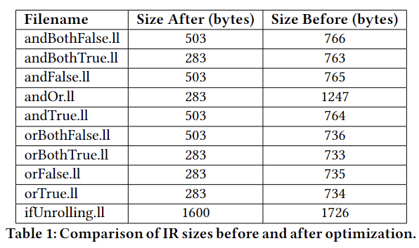

# AST Optimization for Boolean Expressions in C Compiler

## Overview
This project implements a Boolean optimization pass for a subset of the C programming language, targeting the abstract syntax tree (AST) to enhance both compilation efficiency and runtime performance. It focuses on optimizing Boolean expressions using Boolean Algebra and nested loops unrolling.

## Authors
- Khanh Khuat (ltk30)
- Matt Le (dml122)
- Nofer Xue (sxx261)

## Institution
Case Western Reserve University

## Features
- **Optimization Techniques**: Includes constant folding and application of Boolean identities to simplify expressions.
- **AST Manipulation**: Direct manipulation of the AST to streamline expressions before code generation.

## Implementation
The optimization pass identifies inefficient Boolean expressions within the AST and simplifies them using predefined rules and pattern matching. Modifications include node replacement, removal, and addition to optimize overall code execution.

## Testing Methodology
- **Performance Metrics**: Evaluation based on AST structures and compiled binary size  
- **Test Environment**: Tests conducted using the Windows Subsystem for Linux (WSL).

## Results
Example:
```c
int puts(string str);
int main()
{
    if ((5 > 3 || 10 > 7) || (4 >= 5 && 10 <= 12))
    {
        puts("Hello World!");
    }

    return 0;
}
```
<table>
  <tr>
    <td style="vertical-align: top;">
      <p>Before Optimization:</p>
      
    </td>
    <td style="vertical-align: top;">
      <p>After Optimization:</p>
      
    </td>
  </tr>
</table>

After optimization, the if condition would be just True because (5 > 3) returns True -> (5 > 3 || 10 > 7) would be True without validating (10 > 7) which would make the whole if condition True without validating (4 >= 5 && 10 <= 12). This is the Identity Law from Boolean Algebra. 

``` c
int puts(string str);

int main()
{
    int i;
    i = 1;
    if (i < 1)
    {
        if (i < 2)
        {
            if (true)
            {
                if (i < 4)
                {
                    if (i < 5)
                    {
                        puts("Goodbye World.");
                    }
                }
            }
        }
    }

    return 0;
}
```
<table>
  <tr>
    <td style="vertical-align: top;">
      <p>Before Optimization:</p>
      
    </td>
    <td style="vertical-align: top;">
      <p>After Optimization:</p>
      
    </td>
  </tr>
</table>

After optimization, the nested loop conditions change into an and expression of cond1 && cond2 && cond3 && cond4 && cond5 which provide a better AST structure.  
We also see a great enhancement in IR file size after applying our optimization pass:  
<div align="center">
  
</div>

## Conclusion
The implementation of a Boolean optimization pass in this project significantly enhances the efficiency of compiling C code by directly manipulating the AST to optimize Boolean expressions. Through the application of Boolean identities and optimization techniques like constant folding and loop unrolling, the project has demonstrated a notable improvement in both compilation speed and runtime performance. Additionally, it has effectively reduced the complexity and size of compiled binaries, as evidenced by the before and after comparisons of AST structures and IR file sizes. This optimization not only speeds up the code execution but also simplifies the debugging and maintenance of code by creating more streamlined ASTs.

## Acknowledgments
Special thanks to Professor Vipin Chaudhary and the Teaching Assistants for their guidance on LLVM implementation.

## Repository Contents
- We include an Optimization method for logical and, logical or and if statement: MyOptznPass() where we implement our optimization pass
- We have some test cases in the tests folder that the TAs could use to see our implementation results

## How to Run
- Run build.sh to build the project
- Run executeTests.sh to run the test cases
- Check the AST structure for each test cases like the ones we showcase above. You could run the same test cases on the initial Programming 4 without Optimization to see the differences.  

